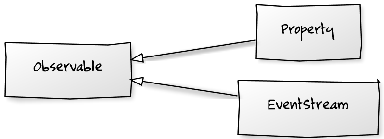
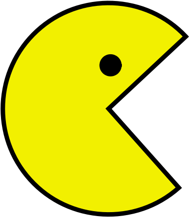

!SLIDE bullets
# frp w/ js #
* juha paananen @raimohanska

!SLIDE code

    managers = new ArrayList<Employee>()
    for (int i = 0; i < employees.size(); i++) {
      Employee e = employees.get(i);
      if (e.title.equals("manager")) {
        managers.add(e);
      }
    }
    return managers;

!SLIDE code

    filter ((== "manager") . title) employees

!SLIDE bullets incremental
#fp - lists
* filter, map, fold, zip, >>=

!SLIDE bullets incremental
#frp - events
* filter, map, scan, merge, combine, >>=

!SLIDE bullets incremental
#RxJs
* microsoft
* free (as in beer)

!SLIDE
#Observable

!SLIDE
#stream-of-events (kinda)

!SLIDE
#.subscribe(callback)

!SLIDE
subscribe :: Observable a -> Observer a -> IO (IO ())

!SLIDE bullets incremental
#Mouse clicks
* $("h1").toObservable("click")

!SLIDE bullets incremental
#Array as Observable
* Rx.Observable.FromArray([1, 2, 3])

!SLIDE
#that's not a stream

!SLIDE
#stream = [(time, event)]

!SLIDE bullets incremental
#Observable
* select, where, take, skip
* merge, zip, combineLatest
* selectMany 

!SLIDE bullets incremental
#bacon.js
* @raimohanska
* open-source

!SLIDE 
#EventStream

!SLIDE
#stream-of-events (really)

!SLIDE
#Property

!SLIDE
#value-as-function-of-time

!SLIDE bullets
* mouseClicks :: EventStream
* mousePos :: Property

!SLIDE center

!SLIDE center

